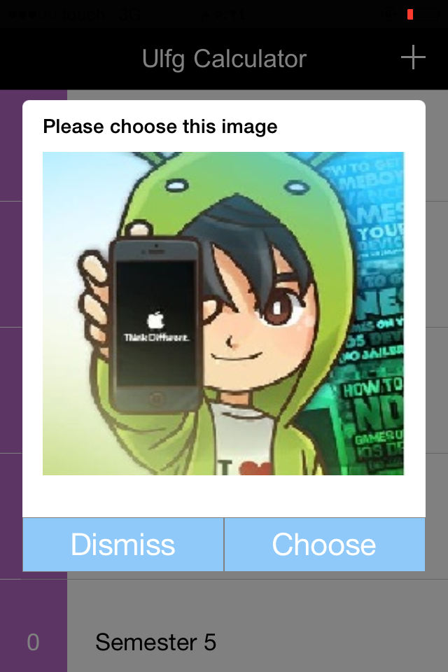
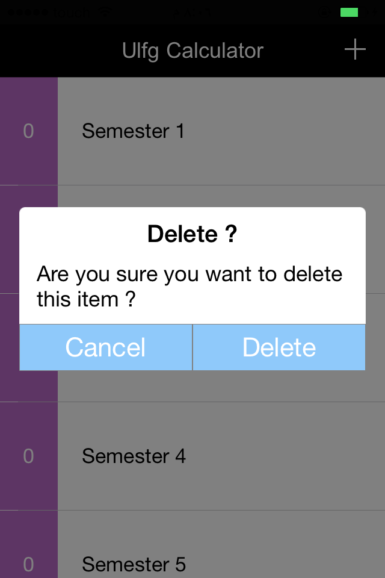

#ISammourAlert

##Description : 

Custom alert for ios wich can hold any type of views and buttons placed in the order the developer wants with some basic animations (I will add more awesome animations soon).
<br/>Creates Labels and TextFields for you .
```cs
	var label = alert.CreateLabel("Label Text",fontSize,bold,UITextAlignment.Left);
	var textField = alert. CreateTextField("placeholder",fontSize,maxNumbersRange,TextFieldStyle.Numeric);
```
##CustomAlert



```cs
{
....

ISammourAlert alert = new ISammourAlert(AlertType.Custom,AnimationType.TopToCenter);
alert.AddView(myImage);
alert.AddView(myLabel);
alert.AddButton("Dismiss",null,fontSize);
alert.AddButton("Choose",ChooseButtonClicked,fontSize);
alert.Show();
}
void ChooseButtonClicked(object sender , EventArgs ea)
{
Console.WriteLine("Choose button Clicked");
}
```

##Normal Alert


```cs
{
....
ISammourAlert alert = new ISammourAlert(AlertType.Normal,AnimationType.BottomToCenter)
alert.Title = "Delete ?";
alert.Message = "Are you sure you want to delete this item ?";
alert.AddButton("Cancel", null, 22);
alert.AddButton("Delete", DeleteItem, 22);
alert.Show();
}
void DeleteItem(object sender , EventArgs ea)
{
Console.WriteLine("Delete button Clicked");
}
```
